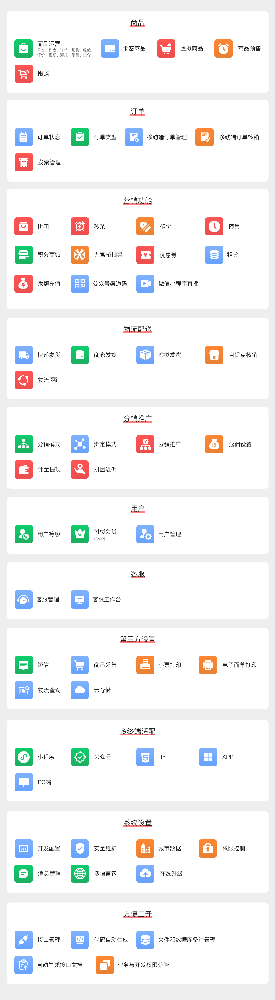
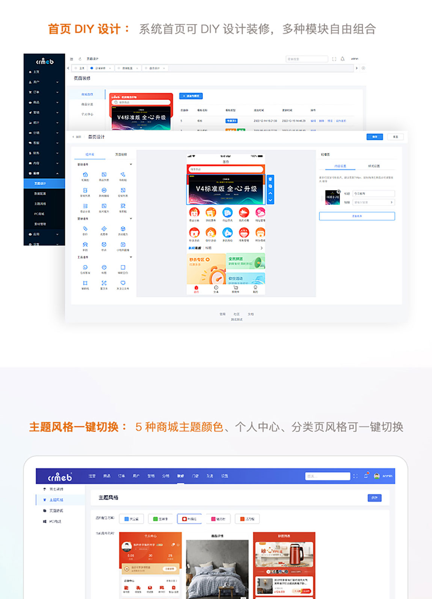
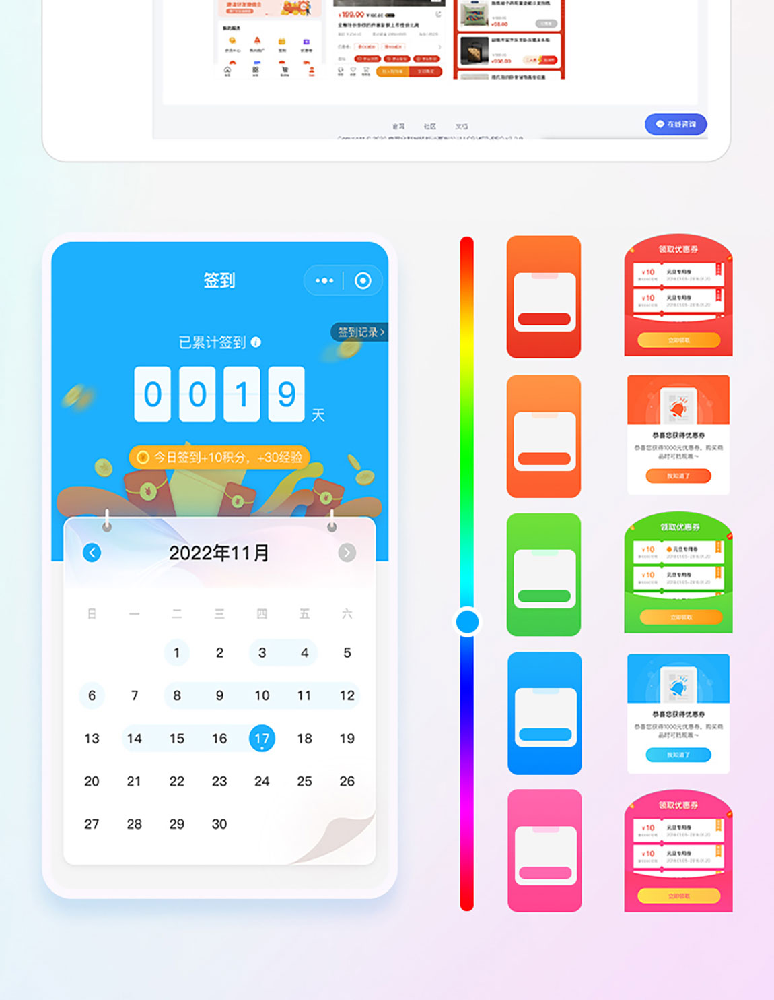

<div align="center" >
    
</div>
<div align="center">

CRMEB开源商城系统PHP版

</div>

<div align="center" >
    <a href="http://www.crmeb.com">
        
    </a>
    <a href="http://www.crmeb.com">
        
    </a>
     <a href="https://gitee.com/ZhongBangKeJi/CRMEB/repository/archive/master.zip">
        
    </a>
    <a href='https://gitee.com/ZhongBangKeJi/CRMEB/stargazers'>
       </img>
    </a>
</div>

#### 

<div align="center">

[官网](https://www.crmeb.com/) |
[在线体验](http://v4.crmeb.net/admin/) |
[帮助文档](https://doc.crmeb.com/single/crmeb_v4) |
[技术社区](https://www.crmeb.com/ask/)

[comment]: <> ([宽屏预览]&#40;https://gitee.com/ZhongBangKeJi/CRMEB/blob/master/README.md&#41;)

</div>
<div align="center" >
<a href="https://gitee.com/ZhongBangKeJi/CRMEB/blob/master/README.md">宽屏预览</a>
</div>

---

### 📋 更新说明

```
v5.0.0 更新说明【更新时间2023年06月12日】
1、后台管理页面增加风格选项切换功能
2、新增接口管理
3、新增代码生成功能，能快速生成基础的增删改查代码，并自动生成菜单和功能页面
4、文件管理和数据库管理增加添加备注功能
5、后台根据新增的路由表，生成接口文档，并支持在线调试
6、权限管理优化，业务和开发分离，分工更明确
7、新增代理商申请页面按钮开关
8、增加小程序发货信息管理接口
9、优惠券优化，优惠券修改后台添加，增加多分类，恢复系统赠送功能
10、后台分类样式统一，优化分类选择体验
11、新增常规配置接口，包含所有的配置开关
12、新增商品详情轮播图点击放大功能
13、调整系统查询sql逻辑
14、提货点，用户筛选等选择城市的，优化读取后台城市表数据
15、调整代理商计算申请等功能
16、优化卡密商品编辑重新上传卡密库存问题
17、优化前端登录时候传入长度以及明文的问题
18、优化虚拟商品未发货之前可以进行退款
19、优化一号通电子面单发货，可以使用多种打印机
20、缓存优化调用以及读取
21、微信支付退款问题优化

v4.7.1 更新说明【更新时间2023年04月26日】
1.优化订单下单时订单号的生成
2.版权设置增加清除缓存，及时生效
3.企业微信无法通知问题修复
4.修复重量体积包邮的问题
5.佣金转入余额报错问题处理
6.拼团未支付的时候查看拼团报错处理
7.自提商品下单后默认门店不是最近的问题处理
8.不能修改cos空间名，cos优化；
9.核销订单部分退款问题优化
10.更新修改后台admin之后无法选择图片的问题
11.卡密商品库存未设置的时候，前端购买提示语优化；
12.修复权限缓存的问题
13.修复拆分的订单无法正常核销的问题
14.处理前端上传头像
15.采集商品详情问题修复
16.diy选择文章分类问题修复
17.移动端收银台时间问题修复
18.处理微信支付在PC端显示二维码错位的问题
19.处理小程序好友代付生成的链接错误问题
20.主播删除之后无法重新添加问题修复
21.修改订单详情的订单状态与列表的订单状态展示不一致
22.用户注销之后，所有的下级清除推广关系；
23.修复后台修改用户手机号绑定重复未作判断
24.用户注销后，推广排行不展示；
25.优化已结束的直播不能添加商品
26.优化退款时是否能选择退款类型，用户编辑优化；
27.直播间详情文字优化，pc退款订单日期显示优化；
28.删除主播确认弹窗问题修复
29.退款退货的订单确认退款时修改订单状态
30.更新商品实际支付金额返佣增加运费计算
31.优化佣金排行数据显示为统计时间内的累计佣金
32.秒杀导出，统计修复；
33.开启消息队列之后，企业微信机器人消息无法发送的问题处理；
34.修改直播间商品展示
35.赠送的优惠券修改发送类型
36.列表开始使用时间字段数据显示有误修复
37.添加的文章回显问题修复
38.优惠券添加时，后台赠送和新用户自动发放的优惠券不填写领取时间；
39.添加时要校验用户领取的数量不能大于优惠券发放的限量
40.修复下单页面使用优惠券的限时使用时间段显示有误的问题
```
### 用心做开源，我们也很需要你的鼓励！右上角Star，等你点亮！

---

### 📝 介绍
CRMEB开源商城系统是一款全开源可商用的系统，前后端分离开发，全部100%开源，在小程序、公众号、H5、APP、PC端都能用，使用方便，二开方便！安装使用也很简单！使用文档、接口文档、数据字典、二开文档、视频教程，各种资料应有尽有，就算你是技术小白，也能轻松上手！

欢迎大家来体验、来提建议，来一起让CRMEB开源商城系统更强大，让更多开发者受益！虽然是开源，但我们该有的功能全都有！拼团、秒杀、优惠券、抽奖、积分、直播、分销、页面DIY... 常用商城系统功能，都是全开源，直接用！

CRMEB开源商城Java版：https://gitee.com/ZhongBangKeJi/crmeb_java

---

### 🫧 系统亮点
~~~
1.前后端分离：后端TP6，管理端iView UI，移动端Uni-app；
2.代码规范：遵循PSR-2命名规范、Restful标准接口、代码严格分层、注释齐全、统一错误码；
3.权限管理：内置强大灵活的权限管理，可以控制到每一个菜单；
4.开发配置：低代码增加配置、系统组合数据模块；
5.二开效率：应用form-builder PHP快速生成表单、内置所有事件、后台接口管理调试、后台代码在线编辑器、代码生成，快速对接第三方接口；
6.快速上手：详细帮助文档、后台接口管理、后台数据库字典、系统文件管理备注、代码注释、一键安装；
7.系统安全：系统操作日志、系统生产日志、文件校验、数据备份；
8.高 性 能：支持Redis缓存、队列、长连接、多种云储存、支持集群部署。
~~~
---

### 🖥 运行环境

```
Nignx/Apache/IIS
PHP 7.1 ~ 7.4 
MySQL 5.7
Redis
```


> 温馨提示：虚拟空间不支持，推荐使用bt宝塔面板，服务器推荐京东云服务器：<a href="https://partner.jdcloud.com/partner/notice/b06c3232b6394fdfa496923b8e00b286" target="_blank">注册即享6.5折专属优惠，点我领取！</a>


###  📱 系统演示


管理后台： http://v5.crmeb.net/admin

账号：demo 密码：crmeb.com

H5端：http://v5.crmeb.net/（移动端打开）

PC端：http://v5.crmeb.net/（电脑端打开）

APP下载：http://app.crmeb.cn/bzv（苹果手机直接在APP Store里搜索CRMEB下载）

> 听说，大神你想看看CRMEB开源项目的完整框架？<a href="https://doc.crmeb.com/single/v5/7712" target="_blank">戳这儿，轻松获取！</a>

---

###  🔐 安装教程

想要快速安装，教程来助攻！<a href="https://doc.crmeb.com/single/v5/7714" target="_blank">查看安装教程！</a>

---

###  📲 核心功能
#### 商城页面维护：自定义底部菜单、5种主题风格切换、分类页风格切换、个人中心风格切换、数据配置、首页DIY设计、开屏广告...
#### 商品：商品运营（分类、列表、详情、规格、收藏、评价、视频、海报、采集、口令）、卡密商品、虚拟商品、商品预售、限购
#### 订单：订单状态、订单类型、移动端订单管理、移动端订单核销、发票管理
#### 营销功能：拼团、秒杀、砍价、预售、积分商城、九宫格抽奖、优惠券、积分、余额充值、公众号渠道码、微信小程序直播
#### 物流配送：快递发货、商家发货、虚拟发货、自提点核销、物流跟踪
#### 分销推广：分销模式、绑定模式、分销推广、返佣设置、佣金提现、拼团返佣
#### 用户：用户等级、付费会员（SVIP）、用户管理
#### 客服：客服管理、客服工作台
#### 第三方设置：短信、商品采集、小票打印、电子面单打印、物流查询、云存储
#### 多终端适配：小程序、公众号、H5、APP、PC端
#### 系统设置：开发配置、安全维护、城市数据、权限控制、消息管理、多语言包、在线升级
#### 方便二开：接口管理、代码自动生成、文件和数据库备注管理、自动生成接口文档、业务与开发权限分管




---

###  📖 UI界面展示





---


###  📕 CRMEB公益
做开源，帮助更多人！CRMEB开源项目，不仅让开发者从中受益，也在公益活动中帮助了很多人，对此，我们很荣幸，也乐此不疲！

So~~想要用CRMEB开源商城系统做公益项目的朋友，可以来免费申请商业版系统哦！有需要的朋友，快去找官方客服咨询吧！

---
###  💎 捐赠
赠人玫瑰，手留余香！CRMEB诚挚地邀请大家积极参与捐赠，我们会将捐赠获得的费用，悉数用于支持公益项目，让善意无限传递下去！
在此深表感谢~

---
###  📞 CRMEB互动
#### 技术娱乐！代码写累了？那就歇会吧！扫码让你开心一刻！

#### 技术社区！找方法、提bug、看官方消息、拿活跃大奖！都在 <a href="https://www.crmeb.com/ask" target="_blank">CRMEB 技术社区</a> 应有尽有
#### 技术交流！跟着官方，不迷路！欢迎扫码加入CRMEB 开源项目群，一手消息及资源，尽在掌握！


---

###  📻 感谢参与开发者
#### 感谢大神们提交代码（排名不分先后）
@yizhisamoye，@bys1123，@xaboy，@youngxj0，@jacklincheung，@392256866，@sxsea

欢迎<a href="https://gitee.com/ZhongBangKeJi/CRMEB/issues" target="_blank">反馈问题</a>

欢迎<a href="https://gitee.com/ZhongBangKeJi/CRMEB/pulls" target="_blank">提交代码</a>

---
###  📸 特别鸣谢
排名不分先后，感谢这些软件的开发者：thinkphp、iview、vue、mysql、redis、uniapp、echarts、tree-table-vue、swiper、form-create等，如有遗漏请联系我！

---
###  🎬 核心开发团队
产品：木子刀客

技术：聆听、等风来、xaboy、吴汐、最后一片叶、旺仔、小小、娜娜、归来仍是少年

UI：xy-yyds、LXT

测试：夏天、绵绵羊、。ws、半山


---
###  📺 使用须知
1、允许用于个人学习、毕业设计、教学案例、公益事业、商业使用；

2、如果商用必须保留版权信息，请自觉遵守；

3、禁止将本项目的代码和资源进行任何形式的出售，产生的一切任何后果责任由侵权者自负。


---
###  💾 版权信息

本项目包含的第三方源码和二进制文件之版权信息另行标注。

版权所有Copyright © 2017-2023 by CRMEB (https://www.crmeb.com)

All rights reserved。

CRMEB® 商标和著作权所有者为西安众邦网络科技有限公司。


---

[返回顶部 :fa-arrow-circle-up: ](https://gitee.com/ZhongBangKeJi/CRMEB#%E9%A1%B9%E7%9B%AE%E4%BB%8B%E7%BB%8D)

